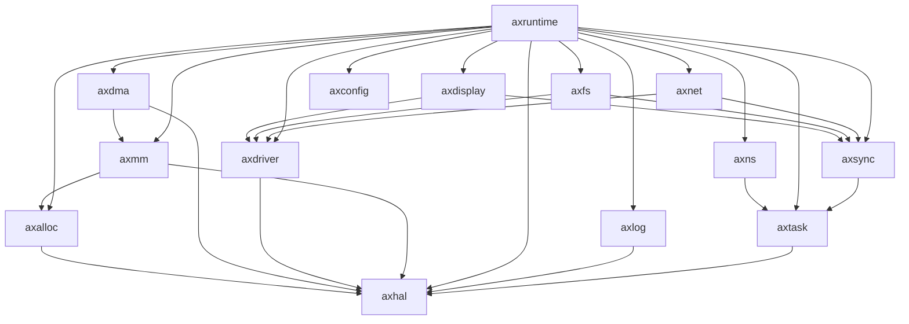

# ArceOS 模块目录下的 14 个核心 Crates 详细分析

对 arceos/modules 目录下的 14 个核心 crates 进行了系统性分析，整理如下：

## 详细分析列表

### 1. axalloc
- **核心功能**：系统内存分配管理
- **主要组件**：
  - `GlobalAlloc` 实现
  - 堆内存分配器
  - 内存统计跟踪
- **依赖关系**：依赖 axhal 获取物理内存信息，被大多数需要堆分配的模块使用
- **架构意义**：为系统提供动态内存分配能力，是 Rust `alloc` 库在裸机环境的基础

### 2. axconfig
- **核心功能**：系统配置参数管理
- **主要组件**：
  - 编译时常量定义
  - 内核参数结构
  - 配置特性开关
- **依赖关系**：几乎不依赖其他模块，被大多数模块使用以获取配置信息
- **架构意义**：集中管理系统参数，提高配置灵活性和一致性

### 3. axdisplay
- **核心功能**：显示设备管理
- **主要组件**：
  - 帧缓冲区抽象
  - 基本图形操作接口
  - 字体渲染支持
- **依赖关系**：依赖 axdriver 获取显示设备，可能依赖 axsync 实现同步
- **架构意义**：提供图形显示能力，支持GUI和终端输出

### 4. axdma
- **核心功能**：直接内存访问控制
- **主要组件**：
  - DMA控制器接口
  - 缓冲区管理
  - DMA传输描述符
- **依赖关系**：依赖 axhal 访问硬件，依赖 axmm 管理物理内存
- **架构意义**：提供高效数据传输机制，减轻CPU负担

### 5. axdriver
- **核心功能**：设备驱动框架
- **主要组件**：
  - 设备抽象接口
  - 驱动注册机制
  - 设备探测和初始化
- **依赖关系**：依赖 axhal 访问硬件，被具体设备使用模块依赖
- **架构意义**：统一设备访问接口，简化驱动开发

### 6. axfs
- **核心功能**：文件系统支持
- **主要组件**：
  - 虚拟文件系统接口(VFS)
  - 文件描述符表
  - 具体文件系统实现
- **依赖关系**：依赖 axdriver 访问存储设备，依赖 axsync 实现并发控制
- **架构意义**：提供统一文件操作接口和持久存储能力

### 7. axhal
- **核心功能**：硬件抽象层
- **主要组件**：
  - CPU架构特定代码
  - 中断控制器接口
  - 时钟和计时器
  - 底层内存访问
- **依赖关系**：几乎不依赖其他模块，是大多数模块的基础依赖
- **架构意义**：屏蔽硬件差异，提供跨平台能力

### 8. axlog
- **核心功能**：日志系统
- **主要组件**：
  - 日志宏(如info!, error!)
  - 日志级别过滤
  - 日志输出目标抽象
- **依赖关系**：可能依赖 axhal 进行底层输出，被几乎所有模块使用
- **架构意义**：提供调试和监控能力，增强系统可观测性

### 9. axmm
- **核心功能**：内存管理和映射
- **主要组件**：
  - 页表管理
  - 物理内存分配器
  - 虚拟地址空间
  - 内存映射函数
- **依赖关系**：依赖 axhal 访问MMU，可能依赖 axalloc 进行元数据分配
- **架构意义**：实现内存隔离和保护，支持虚拟内存

### 10. axnet
- **核心功能**：网络协议栈
- **主要组件**：
  - TCP/IP协议实现
  - Socket接口
  - 网络设备抽象
- **依赖关系**：依赖 axdriver 访问网络设备，依赖 axsync 实现并发控制
- **架构意义**：提供网络通信能力，支持分布式应用

### 11. axns
- **核心功能**：命名空间管理
- **主要组件**：
  - 进程命名空间
  - 资源隔离机制
  - 命名空间切换
- **依赖关系**：与 axtask 紧密集成，可能依赖 axmm 进行内存隔离
- **架构意义**：支持容器化和资源隔离，增强系统安全性

### 12. axruntime
- **核心功能**：系统运行时环境
- **主要组件**：
  - 系统初始化流程
  - 异常处理框架
  - 模块协调机制
- **依赖关系**：依赖几乎所有其他模块，负责它们的初始化和协调
- **架构意义**：系统入口点，各组件的"粘合剂"

### 13. axsync
- **核心功能**：同步原语
- **主要组件**：
  - 互斥锁(RawMutex)
  - 信号量(Semaphore)
  - 条件变量(Condvar)
  - 读写锁(RwLock)
- **依赖关系**：依赖 axtask 进行任务阻塞和唤醒，被许多需要并发控制的模块使用
- **架构意义**：提供线程安全机制，确保多任务环境下的数据一致性

### 14. axtask
- **核心功能**：任务管理与调度
- **主要组件**：
  - 任务控制块
  - 调度器
  - 等待队列(WaitQueue)
  - 上下文切换
- **依赖关系**：依赖 axhal 进行底层上下文操作，被需要多任务的模块使用
- **架构意义**：实现多任务并发执行，操作系统的核心功能之一

## 汇总表格

| Crate | 核心功能 | 主要组件 | 依赖关系 | 架构意义 |
|-------|---------|---------|---------|---------|
| axalloc | 内存分配管理 | 全局分配器、堆管理 | 依赖axhal，被多模块使用 | 提供动态内存分配能力 |
| axconfig | 配置参数管理 | 常量定义、参数结构 | 被多模块依赖 | 统一管理系统配置 |
| axdisplay | 显示设备管理 | 帧缓冲、图形接口 | 依赖axdriver、axsync | 提供图形显示能力 |
| axdma | DMA控制 | DMA控制器、缓冲管理 | 依赖axhal、axmm | 高效数据传输 |
| axdriver | 设备驱动框架 | 设备抽象、驱动注册 | 依赖axhal | 统一设备访问接口 |
| axfs | 文件系统 | VFS、文件描述符 | 依赖axdriver、axsync | 提供文件操作和存储 |
| axhal | 硬件抽象层 | CPU特定代码、中断 | 基础模块 | 屏蔽硬件差异 |
| axlog | 日志系统 | 日志宏、级别过滤 | 被多模块使用 | 提供调试和监控 |
| axmm | 内存管理映射 | 页表、地址空间 | 依赖axhal | 实现内存隔离保护 |
| axnet | 网络协议栈 | TCP/IP、Socket | 依赖axdriver、axsync | 提供网络通信 |
| axns | 命名空间管理 | 资源隔离、命名空间 | 依赖axtask | 支持容器化隔离 |
| axruntime | 运行环境 | 初始化、异常处理 | 依赖多数模块 | 系统入口与协调 |
| axsync | 同步原语 | 互斥锁、条件变量 | 依赖axtask | 确保多任务数据一致性 |
| axtask | 任务调度 | 控制块、调度器 | 依赖axhal | 实现多任务并发 |

这14个模块形成了一个层次清晰、职责分明的操作系统架构，通过精心设计的接口相互协作，支持系统的可扩展性、可维护性和模块化定制。

